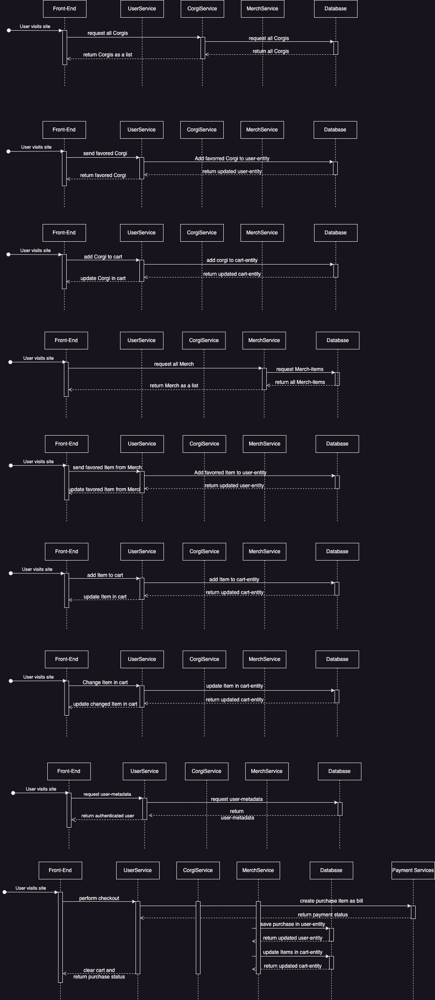

# Software Requirement Specifications (SRS)

## 1. Beschreibung des Dokuments

Das SRS Document beschreibt alle Spezifikationen im Rahmen des Projekts „Corgi-Shop“ und gibt einen Überblick über die Zukunft des Projekts, was die Features und die Begrenzungen inkludiert.

## 2. Vision
„Corgi Shop“ soll eine Mobile Applikation werden, die es Kunden ermöglichen soll Hunde der Rasse Corgi sowie Accessoires mit Corgi Motiven zu erwerben.

## 3. Scope

Folgende Funktionalitäten sollen von der App realisiert werden:

1.	Corgis
      - Corgis aus Back End fetchen und im Front End als Liste darstellen
      - Einzelnen Corgis darstellen und dessen Informationen einsehen
      - Corgis als Favorit speicherbar machen
      - Corgis in den Einkaufskorb hinzufügen/löschen
2.	Merch
      - Merch aus Back-End fetchen und im Front-End als Liste darstellen
      - Einzelne Items vom Merch darstellen und dessen Informationen einsehen
      - Merch in den Einkaufskorb hinzufügen/löschen
3.	Home / Gesamtüberblick
      - Corgis anschauen
      - Merch anschauen
      - Eigenes Profil anschauen
4.	Checkout
      - Bearbeiten des Warenkorbs wie Items/Corgis löschen oder Stückzahl ändern
      - Bezahlen der Artikel im Warenkorb
5.	Profil
      - Eigene Informationen anschauen
      - Einloggen/Ausloggen
6.	Admin
      - Verwalten aller Items/Corgis dh. hinzufügen, löschen, ändern etc.
      - User verwalten bzw. löschen

## Verwendete Tech-Stacks:

Backend:
- Java
- Spring Boot
- PostgresSQL (TablePlus)

Frontend:
- Swift (UI)
- iOS Kits
- SwiftData

IDE:
- IntelliJ Ultimate
- Xcode

Projektmanagement:
- Jira (Atlassian)
- Github Docs / Discussions

Deployment:
- Docker

Testing:
- JUnit

## 4. GUI-Mock-Up (Profil/User)

Das GUI-Mock-Up stellt das zukünftige Graphical User Interface der App dar.
Das erste Bild zeigt wie die Corgis im Katalog und das zweite wie die Seiten individueller Corgis in der App jeweils angezeigt werden sollen.

## 5. Use-Case-Diagramm

Das Use-Case-Diagramm illustriert die verschiedenen Anwendungsmöglichkeiten der Corgi-Shop-App. 
Kunden sollen die Möglichkeit haben, sich einzuloggen, Corgis oder Merchandise-Produkte anzusehen, diese zu kaufen oder den Bezahlvorgang zu starten. 
Das Log-In sowie das Checkout und das Kaufen von Produkten wird zuerst über das Back-End verarbeitet und gegebenenfalls werden mit der Datenbank Daten ausgetauscht. 
Der Bezahlvorgang selbst wird von den Payment Services über das Back-End verwaltet.

## 6. Sequenzdiagramm

Das Sequenzdiagramm zeigt aktuell wie die App die Corgis aus der Datenbank zieht und anzeigt.
Es wird aktualisiert sobald weiteres vollständig implementiert wurde.
