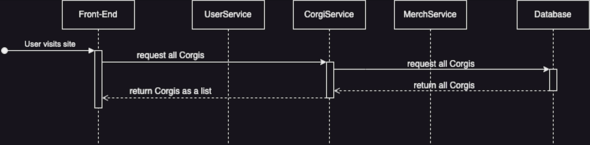
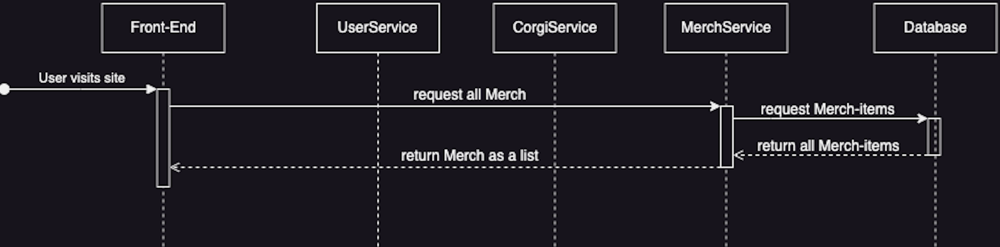
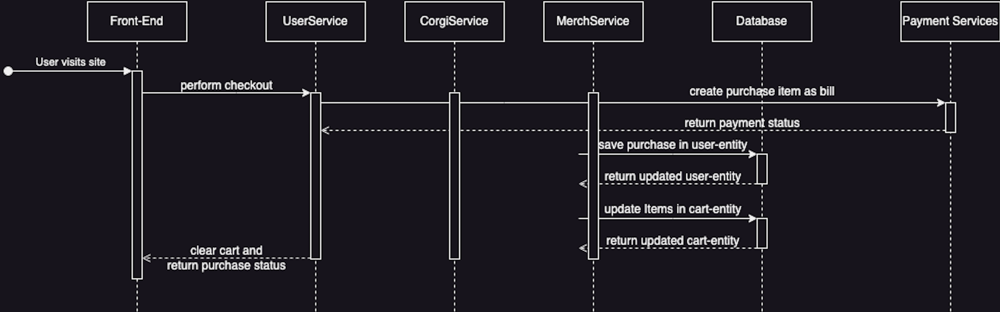

# Use-Case Realization Specification: Corgi-Tab
Dieses Dokument beschreibt die Interaktionen und den Dialog hinter dem Corgi-Tab.

## 1. Beschreibung
Der "Corgi-Tab" (oder auch "Corgi-Page" genannt) zeigt die verfügbaren Corgis des Shops in einer Liste an.
Des weiteren kann der*die User per Click auf einen Corgi in einem DetailView aufrufen.

### 1.1 Screenshot

### 1.2 Scope
Der Scope ist wie folgt:
- Per Click auf den Corgi-Tab soll eine Liste dem*der User angezeigt werden
- Bei weiterem Click, auf einen Corgi, wird ein DetailView geöffnet, wo Details wie Preis, Gewicht usw aufgeführt wird
- Auch gibt es hier die Möglichkeit auf den Cart um den Corgi in den Cart zu befördern
- Der Stern ermöglicht es den Corgi sich zu merken

### 1.3 Definitionen, Abkürzungen und Begriffe
- 

### 2. Flow of Events
Flow of Events beschreibt den Verlauf zwischen Interaktion der*des User und den technisches Hintergrundprozessen.

#### 2.1 Corgi-List
Beim Click auf den Tab "Corgis" wird der Corgi-Tab geladen und es werden aus dem Back End das entsprechende Array an Objekten gefetched.
Im Back End holt Spring Boot die entsprechenden Daten aus einer Datenbank und baut die Objekte zusammen und returned sie ans Front End, wo sie im State gehalten werden.

#### 2.2 Corgi-DetailView
Beim Clicken auf einen Corgi aus der Liste wird der entsprechende Corgi im DetailView aufgeführt und erhält das entsprechende Objekt aus der Liste.

[//]: # (TODO Cart ergänzen "#### 2.3 In den Cart hinzufügen")

[//]: # (TODO Merken ergänzen "#### 2.4 Corgi merken")

### 3. Sequenzdiagramm

