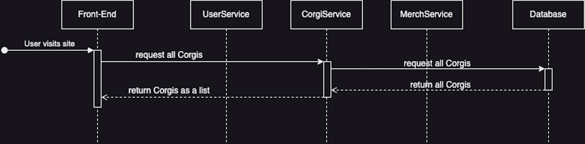

# Use-Case Realization Specification: Corgi List

## 1. Beschreibung
CorgiList ermöglicht es Users eine Liste von Corgis im Corgi-Shop unter dem Reiter "Corgis" anzuzeigen. 
Die Liste wird auf der Benutzeroberfläche angezeigt und zeigt verschiedene Informationen zu den verfügbaren Corgis wie den Namen.
Desweiteren kann der User auf einzelne Corgis klicken und wird auf die Corgi-Page weitergeleitet, wo er weitere Informationen zu dem Corgi einsehen kann.
[Dies ist weiter beschrieben in dem Use-Case Realization Specification: CorgiDetails]

### 1.1 Screenshot

### 1.2 Scope
Diese Use-Case Realization Specification bezieht sich auf die CorgiList und ihre Interaktionen in der App. Sie hat Auswirkungen auf die Navigation und die Benutzererfahrung im Zusammenhang mit der CorgiList.

### 1.3 Definitionen, Abkürzungen und Begriffe
- CorgiList: Liste von Corgis im Corgi-Shop unter dem Reiter "Corgis"
- ListView: Liste von Elementen in der App (iOS/SwiftUi spezifische Benennung)
- CorgiDetail: Detailansicht eines einzelnen Corgis

### 2. Flow of Events
Der Ablauf der Ereignisse im Zusammenhang mit der CorgiList ist wie folgt:
\n
- User landet auf Home-Page und kann in der unteren Leiste (TabView) navigieren
- User kann auf "Corgis" klicken und landet auf der Corgi-Page
- Corgis werden aus dem BackEnd gefetcht und mit SwiftData aufbereitet
- CorgiList wird im FrontEnd angezeigt (mit Namen und Bild)
- User kann auf einzelne Corgis klicken und wird auf die CorgiDetail-Navigation weitergeleitet

### 3. Sequenzdiagramm

